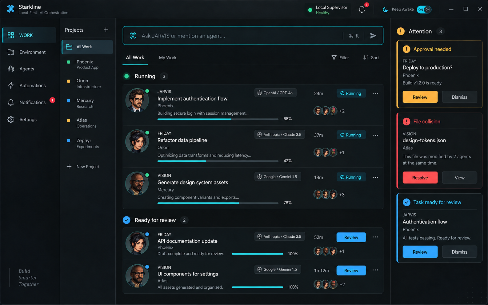
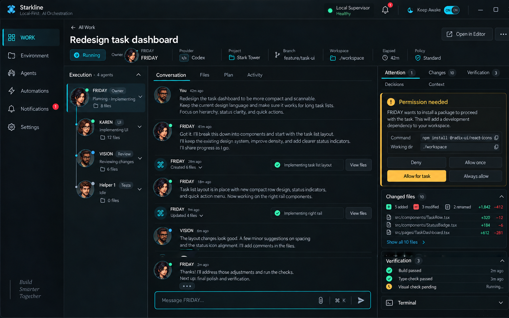
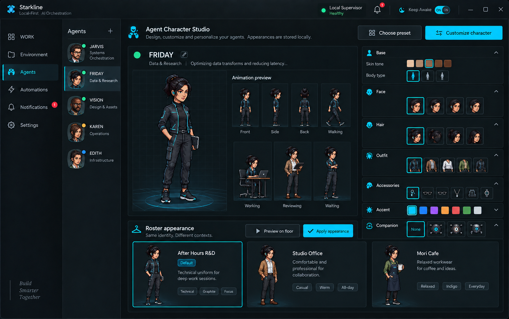
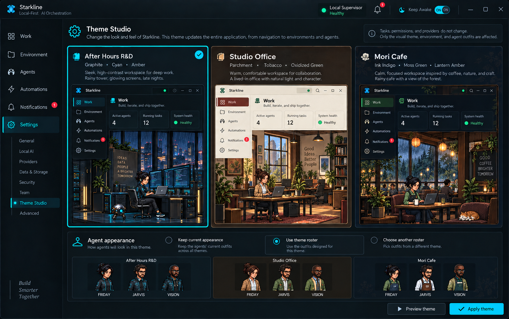
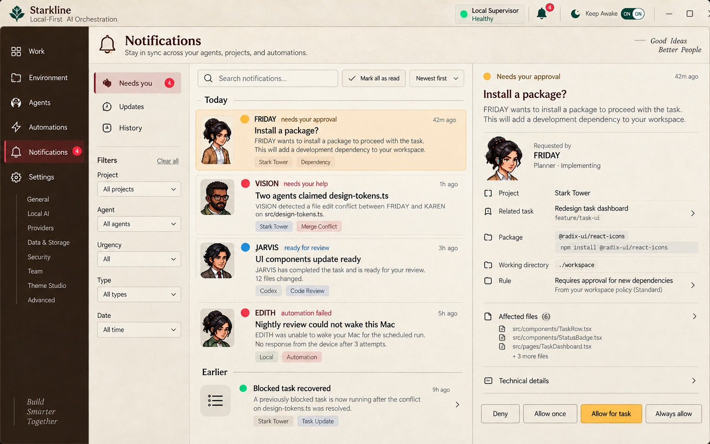
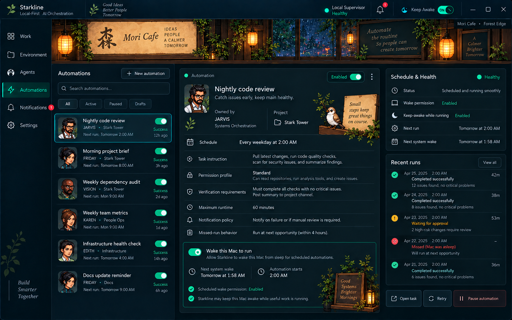
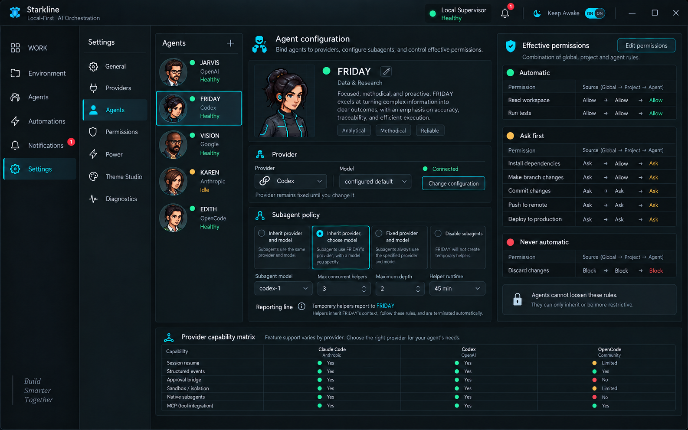
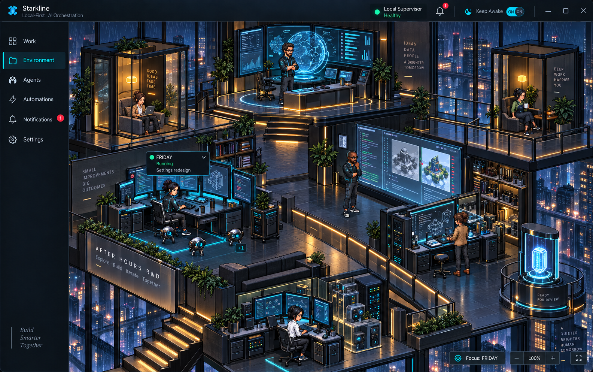
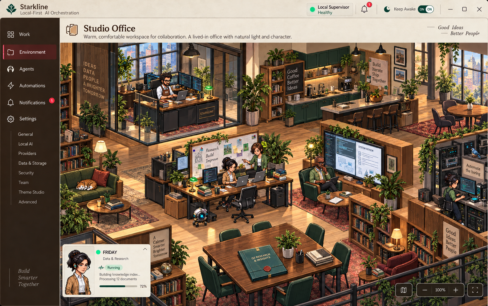
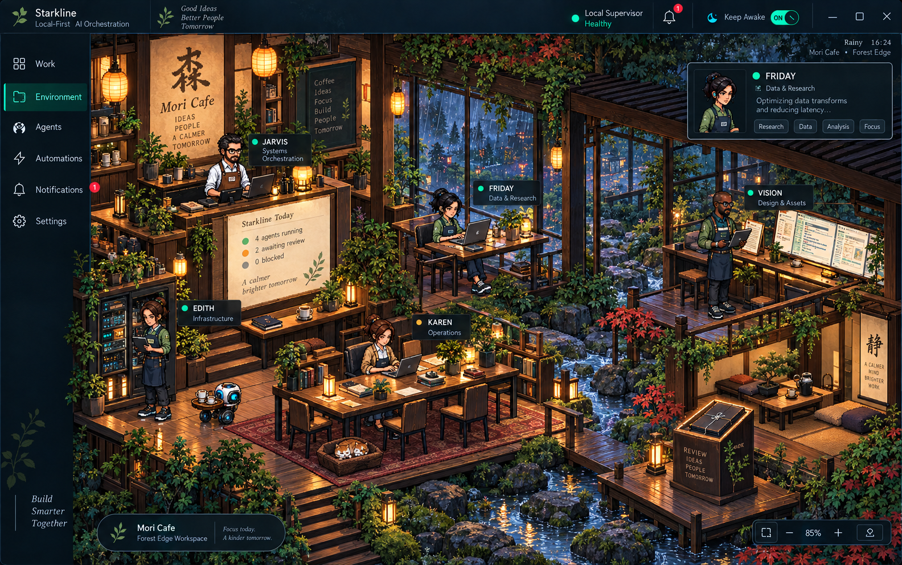

# Stark Tower Visual Mockups

These mockups accompany the [product and experience design](../../plans/2026-09-16-stark-tower-product-and-experience-design.md). They define the visual-quality target for implementation. Sample copy and data are illustrative; product behavior and provider capability claims must follow the specification and real runtime state.

`Starkline` is the approved product name shown in the application shell (developer decision, 2026-10-05). Stark Tower remains the project name and the After Hours R&D theme's identity.

## Operational surfaces

### Work dashboard, After Hours R&D

### Task detail, execution tree, and approval flow

### Agent Character Studio and roster outfits

### Theme Studio and full-shell theming

### Notification Centre, Studio Office

### Automations and scheduled wake, Mori Cafe

### Agent provider, subagent, and permission configuration

## Living environments

### After Hours R&D

### Studio Office

### Mori Cafe and forest edge

## Locked visual decisions

- All named agents use high-detail pixel characters. Realistic human portraits are not used.
- The same character identity drives portraits, roster cards, floor sprites, and animation frames.
- Roster packs change outfits while preserving identity.
- The selected theme reskins the complete application shell and Environment.
- Information architecture and task-state meaning remain stable across themes.
- Environment status is communicated through position, posture, props, and light before labels.
- Temporary subagents appear as smaller companions rather than full-size employees.
- These images are acceptance references, not disposable moodboards.
